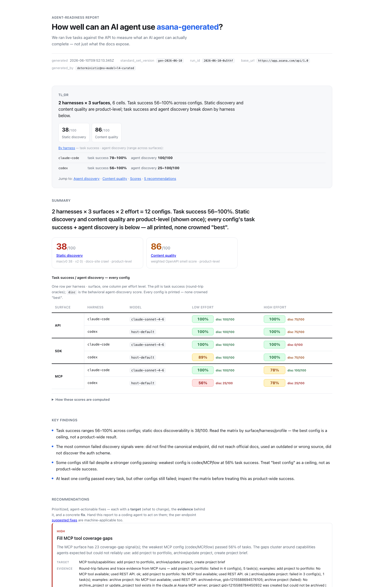
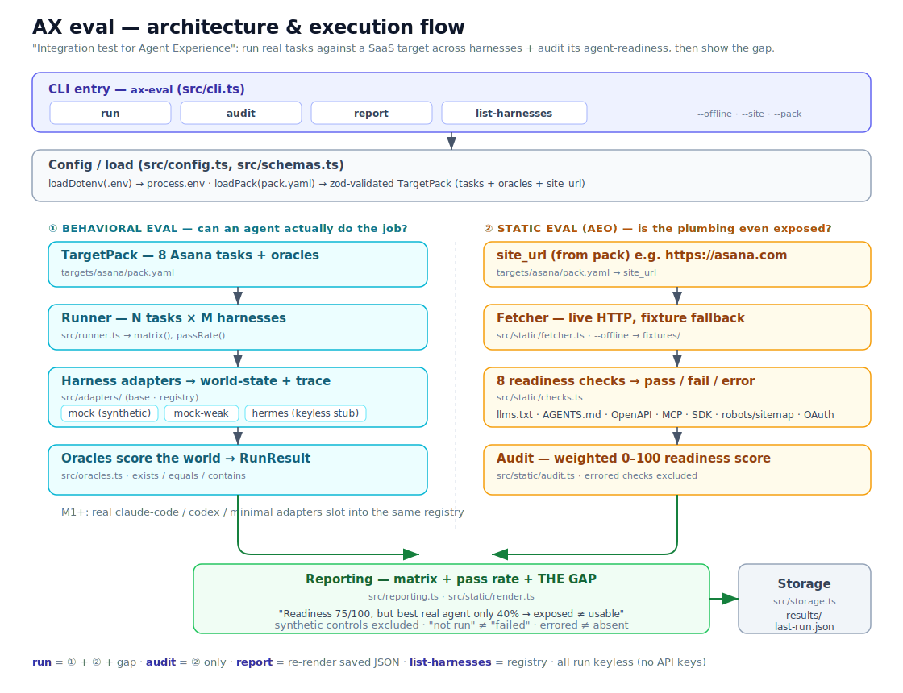

# ax-eval is the open-source, CLI-first way to test whether AI agents can discover and use your product.

## API · CLI · SDK · MCP across Codex and Claude Code

## Can AI agents actually use your product?

AI agents are becoming users of software. But most teams still test docs, APIs,
SDKs, CLIs, and MCP servers as developer-facing artifacts, not as interfaces
agents must discover and operate. `ax-eval` runs reviewed sandbox tasks through
real agent harnesses, then verifies outcomes with independent outcome verification.

**Agent-facing surfaces need integration tests, not just publication checks.**



## What It Measures

- **Discoverability:** can an agent-style crawl find docs, auth, and machine-readable surfaces?
- **Agent discovery:** what did the real agent do from a cold start?
- **Spec quality:** is the OpenAPI/GraphQL surface clear enough to plan from?
- **Task success:** did the sandbox state actually change as requested?
- **Surface gaps:** does API pass while SDK, CLI, or MCP fails?
- **Actionability:** recommendations are written as `Target / Evidence / Fix`.

The open skill can run through the agent you already have open. The CLI can also
drive local harnesses directly with `exec-plan --invoke --harness
claude-code|codex`, producing the same neutral report matrix.

## Quickstart

Install and run the keyless checks:

```bash
git clone https://github.com/chenmingtang830/ax-eval.git
cd ax-eval
npm install

npm run ax-eval -- run --offline
npm run ax-eval -- audit --offline
npm test
```

Run a live eval against a sandbox. `generate` is LLM-assisted by default: it
builds a rule-derived seed from the spec, then asks a local generator harness
(`codex` or `claude-code`) to turn it into a product-quality pack. Product
presets can add authoring hints for the fuzzy parts, but code still enforces
surface coverage, schema validity, and a repair pass if the first draft drops
required metadata or tasks. Use
`--deterministic` when you need a keyless CI/offline fixture instead.

For an end-to-end report workflow, `automate-report` bootstraps discovery, pack
generation, review/auth handoff, smoke execution, verification, and final report
packaging. It never uses Exa; pass explicit official URLs when you have them, or
let the configured local harness find candidates with its native web/search
capability and ax-eval will validate them by fetching official pages directly.
Generated packs still stop at the review gate until a human explicitly approves
them with `ax-eval review`.

```bash
npm run ax-eval -- automate-report --company Acme \
  --openapi https://example.com/openapi.json \
  --surface all \
  --harness codex
```

```bash
# 1. Draft a task pack from a public spec, then review/freeze it.
npm run ax-eval -- ingest --openapi https://example.com/openapi.json \
  --out results/acme-ingest.json
npm run ax-eval -- generate --from results/acme-ingest.json
npm run ax-eval -- review --pack results/acme.generated.pack.yaml --approve --by you

# 2. Fill only the credentials and sandbox ids this pack declares.
npm run ax-eval -- init --pack results/acme.generated.pack.yaml >> .env
npm run ax-eval -- check-env --pack results/acme.generated.pack.yaml

# 3. Emit prompts, run them, then verify with independent outcome verification.
npm run ax-eval -- exec-plan --pack results/acme.generated.pack.yaml \
  --run-dir results/runs/acme
npm run ax-eval -- verify-generated --pack results/acme.generated.pack.yaml \
  --results results/runs/acme/run-*.json \
  --min-pass-rate 0.8 \
  --html results/runs/acme/eval.html
```

`verify-generated` writes a saved report snapshot next to the HTML by default.
You can re-render that exact report later without touching live state:

```bash
npm run ax-eval -- render-generated \
  --snapshot results/runs/acme/generated-eval.snapshot.json \
  --html results/runs/acme/generated-eval.html
```

GraphQL targets use the same review and verification gate:

```bash
npm run ax-eval -- ingest --graphql https://api.example.com/graphql \
  --out results/acme-graphql-ingest.json
npm run ax-eval -- generate --from results/acme-graphql-ingest.json \
  --product Acme --out results/acme.generated.pack.yaml
```

For CI/offline fixtures, keep the rule-derived path explicit:

```bash
npm run ax-eval -- generate --deterministic --from results/acme-ingest.json \
  --product Acme --out results/acme.generated.pack.yaml
```

The repo ships example target packs under `targets/examples/`. Adding another SaaS should
usually be a new pack, not a code change.

## Examples

The repo ships self-contained HTML reports under [`examples/`](./examples/):

- [Stripe four-surface cross-harness report](./examples/stripe-four-surface-cross-harness.html)
- [Notion four-surface cross-harness report](./examples/notion-four-surface-cross-harness.html)
- [Linear GraphQL cross-surface, cross-harness report](./examples/linear-graphql-cross-surface-cross-harness.html)
- [Exa cross-harness, cross-surface report](./examples/exa-cross-harness-cross-surface.html)

Stripe and Notion are the current four-surface examples: one product evaluated
across `API / SDK / CLI / MCP`, with both `claude-code` and `codex` in the same
matrix. Linear shows the GraphQL path; Exa shows a non-CRUD/search API case.
These examples are the fastest way to see what a finished ax-eval artifact looks
like.

These are stable copies of real run artifacts, so you can inspect the output
without digging through `results/runs/`.

## Planned DAEB-1 Publication Flow

DAEB-1, the AXArena database benchmark, uses a stricter publication pipeline
than ordinary local pack authoring:

```text
evaluation suite -> vendor verification extraction -> TargetPack -> execution -> verification -> normalized records -> leaderboard
```

This revision documents the direction only. The canonical suite, compiled
vendor packs, and dedicated production/publication commands are introduced by
later implementation changes and are not available in this revision.

The planned canonical benchmark contract will live at
`targets/suites/daeb-1-v3.yaml`. Each database vendor will have a compiled pack
under `targets/packs/<vendor>/daeb-1-v3.yaml`, but those packs are execution
artifacts, not independently authored benchmark definitions. They will be
produced from the same suite plus vendor-specific public metadata,
outcome-verifier checks, auth/base URLs, explicit N/A reasons, and surface configuration.

For DAEB-1/database v1, the benchmark-of-record production lane is narrower
than the generic engine: `api` and `cli` only, Codex and Claude Code only, one
medium-effort model per harness, and three trials per supported
vendor/surface/harness cell. SDK remains available in the engine, but DAEB-1
SDK evidence is research-only for v1. A later implementation introduces the
planned `daeb-production-rerun` command for this lane.

Each planned cell will write `trial-1/2/3` evidence plus an `aggregate/` record
with mean pass rate, observed range, and links to the source trial artifacts.
After running and verifying the vendor matrix, the planned
`publication-bundle` command will freeze the publication artifacts.

The bundle will write `manifest.json` tying together the canonical suite,
vendor cards, verification extracts, compiled TargetPacks, approvals,
snapshots, normalized records, and competitive report. Missing live artifacts
will be listed explicitly; a publication-ready DAEB-1 v1 bundle has no missing
references and all required quality gates passing.

`ax-eval` remains the tooling layer. The AXArena website should consume an
exported dataset instead of learning runner internals or recomputing scores.
The planned `export-publication` command will provide that boundary.

That export will write website-ready JSON indexes for leaderboard rows, cells, task
drilldowns, trial outcomes, evidence links, methodology metadata, and failure
review placeholders. New reusable benchmark tooling should live here; the
`axarena` repo should own the curated website, narrative, and presentation.

## Architecture

`ax-eval` is pack-centered and surface-aware.

- **Contracts:** `TargetPack`, `Task`, `OracleSpec`, and per-surface auth/config
  live in versioned schemas and act as the stable center of the system.
- **Execution matrix:** the same reviewed pack runs across one or more harnesses
  and surfaces (`api`, `cli`, `sdk`, `mcp`), with surface adapters changing how
  the agent discovers and acts rather than changing the outcome-verification
  model. When a surface only covers part of the product, generation narrows
  that surface to the subset of tasks it can actually support instead of
  forcing API-shaped tasks onto it.
- **Truth layer:** executors report ids, but success is decided by independent
  read-back verification against live product state.
- **Interpretation layer:** reports and normalized records turn results, traces,
  and transcripts into recommendations and comparisons.

See [ARCHITECTURE.md](./ARCHITECTURE.md) for the full system design.

## How It Works



1. **Ingest:** parse OpenAPI, GraphQL, docs, auth, and sandbox hints.
2. **Generate:** draft an L1-L4 task pack with rule-derived outcome verifiers and
   LLM-assisted task authoring by default.
3. **Review:** hash-lock the pack after human approval and Pack QA warnings.
4. **Execute:** run the same pack across selected surfaces and harnesses, with
   each surface taking the tasks that generation marked as truly supported.
5. **Verify:** read live state back, score the matrix, and write reports.

## Why It Is Different

- **Goal-level prompts, not endpoint hints.** The agent has to discover the
  surface instead of being handed a curl command.
- **Programmatic outcome verification, not self-report.** Success means the verifier can read
  the expected state back from the product.
- **Target-declared auth and sandbox scope.** Packs say exactly which env vars and
  sandbox ids are needed; secrets stay local in `.env`.
- **Read-only database verification.** SQL and MongoDB oracles name connection
  environment variables; credentials never enter packs or executor results.
- **Layered gates, not misleading green.** `--min-pass-rate` reports the overall
  gate and per-surface subgates, so a weak MCP or SDK surface remains visible.
- **Competitive reports from the same records.** Stack normalized results across
  products or surfaces to see where competitors, SDKs, CLIs, APIs, or MCP servers
  are easier for agents to use successfully.

## Command Map

```bash
npm run ax-eval -- ingest --openapi <url>       # parse REST/OpenAPI into an ingest file
npm run ax-eval -- ingest --graphql <endpoint|file> # rich GraphQL introspection
npm run ax-eval -- generate --from <ingest.json> [--base-url <graphql-endpoint>] # LLM-assisted by default
npm run ax-eval -- generate --deterministic --from <ingest.json> # CI/offline fallback
npm run ax-eval -- review --pack <pack.yaml> [--approve --by you]
npm run ax-eval -- init --pack <pack.yaml> [--surface all]
npm run ax-eval -- check-env --pack <pack.yaml> [--surface all]
npm run ax-eval -- automate-report --company <name> [--openapi <url>|--graphql <endpoint>] # no Exa; stops at review/auth gates before smoke/full
npm run ax-eval -- exec-plan --pack <pack.yaml> --run-dir <dir>
npm run ax-eval -- exec-plan --pack <pack.yaml> --invoke \
  --harness claude-code --surface all --profile low --profile high \
  --model sonnet --run-dir <dir> --invoke-retries 0 # Claude Code, records the actual reported Sonnet model
npm run ax-eval -- exec-plan --pack <pack.yaml> --invoke \
  --harness codex --surface all --profile low --profile high \
  --model <gpt-model> --run-dir <dir> --invoke-retries 0 # Codex, use a Codex-compatible model slug
npm run ax-eval -- verify-generated --pack <pack.yaml> --results <run.json>... \
  --html <out.html> [--snapshot <out.snapshot.json>]
npm run ax-eval -- render-generated --snapshot <report.snapshot.json> [--html <out.html>]
npm run ax-eval -- reset --pack <pack.yaml> [--dry-run]

npm run ax-eval -- audit --site <url>
npm run ax-eval -- discover --site <url>
npm run ax-eval -- smells --openapi <url>
npm run ax-eval -- competitive --results <normalized.json>... --html <out.html>
```

CI should validate frozen packs, approvals, deterministic fixtures, tests, and
typecheck. It should not depend on live LLM-assisted regeneration; fresh pack
authoring is a developer workflow that ends at `review --approve`.

For publication-grade cross-harness lanes, prefer native host-agent binaries over
PATH wrappers when a wrapper injects unrelated local config. `AX_EVAL_CLAUDE_BIN`
and `AX_EVAL_CODEX_BIN` let a run pin the executable while the normalized record
still stamps the model actually reported by the harness. Non-MCP Codex cells are
run with an isolated Codex home and `mcp_servers={}` so API/CLI/SDK scores are not
polluted by the operator's unrelated global MCP server logins.

## Safety

Live evals make real writes. Use a sandbox, never production. `init` prints the
env stub a pack declares; `.env` is git-ignored. Surfaces authenticate
independently, so an unavailable SDK/CLI/MCP credential becomes a blocked cell in
the report instead of a misleading failure. OAuth-backed MCP surfaces can be run
headlessly when the pack declares client id, client secret, refresh token, and token
URL env names: ax-eval exchanges the refresh token at invoke time, passes the
short-lived bearer only to the child harness environment, and keeps secret values out
of tracked files.

Packs can declare backward-compatible env aliases too: top-level auth supports
`env_aliases` / `verify_env_aliases`, and token-authenticated SDK/CLI/MCP
surfaces support `token_env_aliases`. The first name stays canonical in packs
and prompts; aliases let an older local setup keep working without changing the
benchmark artifact.

`verify-generated` reads live product state. Do not reset or sweep the sandbox
until after the report is rendered and the user explicitly asks for cleanup.
Cleaning first will make otherwise valid result ids read back as missing and
will corrupt the report.

If you want a stable artifact for examples, review, or later design work, keep
the saved report snapshot and use `render-generated` instead of re-running live
verification. Re-rendering from the snapshot preserves the report inputs; a new
`verify-generated` is a fresh measurement.

Generated packs are executable intent. `exec-plan` refuses unreviewed or changed
packs unless you explicitly bypass the review gate.

## Repository Layout

```text
ARCHITECTURE.md     full technical architecture and system design
src/                CLI, generation, verification, reporting, static checks
src/ingest/         OpenAPI and GraphQL ingestion
src/generate/       task-pack generation, review, report, normalized records
src/harness/        host-agent profiles, transcripts, traces, probe
src/surface/        API, CLI, SDK, MCP surface prompt adapters
src/target/         pack-declared auth, sandbox scope, reset
targets/            target-pack index and example pack directories (see targets/README.md)
examples/           stable example reports and case-study artifacts
tests/              vitest suite, keyless/offline by default
assets/             README images and report screenshots
docs/               maintainer-local notes, intentionally not public docs
```

## Contributing

See [`CONTRIBUTING.md`](./CONTRIBUTING.md). The best first contribution is a new
target pack generated from a public spec, reviewed with the gate, and backed by a
focused test or outcome-verifier improvement.

## Contact

Questions, target ideas, or agent-usability examples? Open an issue or reach me
on X: [@richardt830](https://x.com/richardt830).
