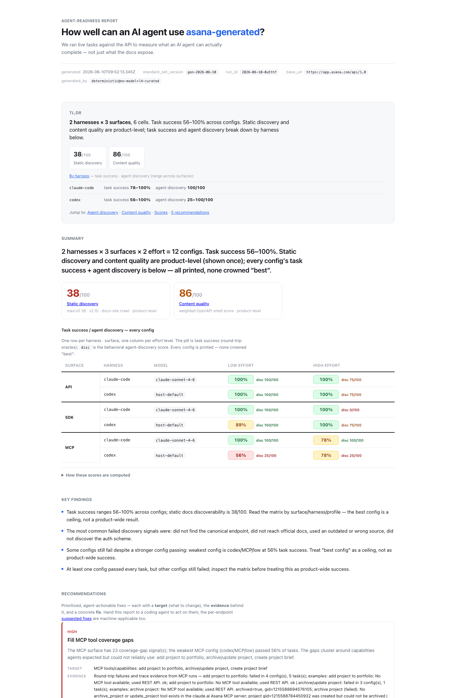
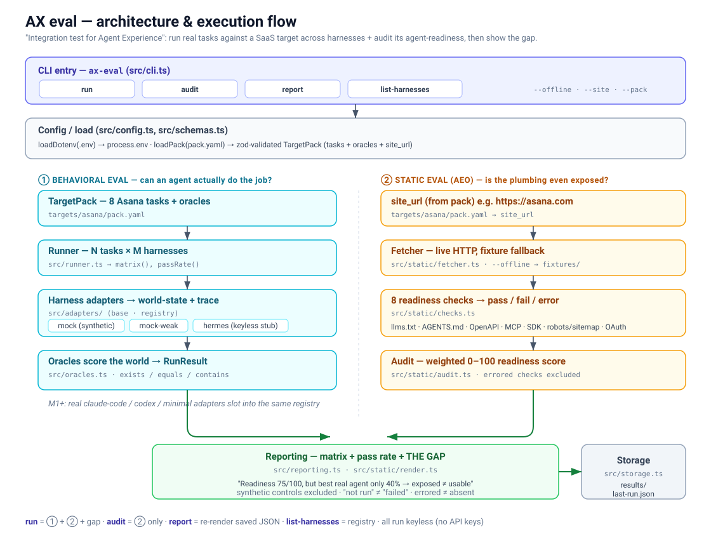

# ax-eval is the open-source, CLI-first way to test whether AI agents can discover and use your product.

## API · CLI · SDK · MCP across Codex, Claude Code, and OpenCode

## Can AI agents actually use your product?

AI agents are becoming users of software. But most teams still test docs, APIs,
SDKs, CLIs, and MCP servers as developer-facing artifacts, not as interfaces
agents must discover and operate. `ax-eval` runs reviewed sandbox tasks through
real agent harnesses, then verifies outcomes with independent outcome verification.

**Agent-facing surfaces need integration tests, not just publication checks.**



## What It Measures

- **Discoverability:** can an agent-style crawl find docs, auth, and machine-readable surfaces?
- **Agent discovery:** what did the real agent do from a cold start?
- **Spec quality:** is the OpenAPI/GraphQL surface clear enough to plan from?
- **Task success:** did the sandbox state actually change as requested?
- **Surface gaps:** does API pass while SDK, CLI, or MCP fails?
- **Actionability:** recommendations are written as `Target / Evidence / Fix`.

The open skill can run through the agent you already have open. The CLI can also
drive local harnesses directly with `exec-plan --invoke --harness
claude-code|codex|opencode`, producing the same neutral report matrix. OpenCode
is the third, open-source core runner across API, CLI, SDK, and MCP cells.

## Quickstart

Install and run the keyless checks:

```bash
git clone https://github.com/chenmingtang830/ax-eval.git
cd ax-eval
npm install

npm run ax-eval -- run --offline
npm run ax-eval -- audit --offline
npm test
```

### Library API

`ax-eval` also exposes a typed ESM entry point for orchestration code that needs
to validate reviewed packs, select surface-compatible tasks, verify results, or
consume normalized records without importing private `src/` paths:

```ts
import {
  EvaluationCellSchema,
  TargetPackSchema,
  checkApproval,
  createRuntimeExtensionRegistry,
  runCell,
  tasksForSurface,
  verifyGeneratedPack,
} from "ax-eval";
```

`runCell` is the policy-free execution boundary: one reviewed pack, target,
surface, harness, model, effort, trial, batch, and immutable source revision in;
one strict `ax.normalized-cell-record/v1` record out. The input and output are
validated by `schemas/evaluation-cell.v1.json` and
`schemas/normalized-cell-record.v1.json`. Aggregation and comparison emit
`ax.normalized-result/v2`, whose identity is
`{product, surface, harness, model, effort}`; legacy v1 records remain unchanged
and readable by compatibility commands. Credential values
are passed out-of-band in `RunCellOptions`, and only names listed by the cell are
forwarded to its isolated harness environment. Controllers may provide a
separate `verificationCredentials` map for health checks, target adapters, and
live read-back; those values are never copied into the harness child.

The same contract is available as a subprocess:

```bash
ax-eval cell run --input cell.json --output record.json
```

The cell runner never chooses a benchmark roster, model, effort, trial count, or
batch identity, and it does not aggregate, rank, publish, or clean up. A
controller such as ax-arena owns those policies and must pass `batch_id`
unchanged to every cell. Verification reads live state before the record is
returned; cleanup remains an explicit later lifecycle step.

Controllers compose versioned, per-cell runtime behavior through one immutable
registry:

```ts
const registry = createRuntimeExtensionRegistry({
  oracleProviders,
  provisioningProviders,
  healthCheckProviders,
  resetProviders,
  targetAdapters,
});
const record = await runCell(cell, {
  credentials: hostCredentials,
  verificationCredentials: verifierCredentials,
  extensions: { registry },
});
```

Duplicate IDs and ambiguous matches fail before invocation. Health checks run
before provisioning, provisioning environment changes are additive, and only
selected or invoked provider IDs and versions appear in optional
`provider_provenance`. A selected target adapter may replace only the independent
verification transport; it receives immutable explicit runtime context. The
runtime-computed, bounded resource namespace is persisted as
`execution_namespace`. `runCell` never invokes reset: the controller must first
persist the verified record, then plan and execute bounded cleanup and persist
its separate evidence. Global oracle registration remains only for direct
`verifyGeneratedPack` compatibility.

Pass controller-only read-back secrets through `verificationCredentials`; they
are available to health checks, verification clients, and oracle providers but
never copied into the harness child. Provisioning never receives verifier-only
credentials, cannot replace PATH or
any scoped/core environment key, and all environment values it adds are treated
as secrets during artifact and error redaction. Providers may request additive
`pathEntries`; core canonicalizes and prepends only real directories outside
the writable cell workspace and artifact tree. Required tools must already be
pinned in those external directories.

The pack reference carries a full SHA-256 of the exact pack file in addition to
the existing approval sidecar check, so executable surface/auth changes cannot
hide behind the narrower legacy approval digest. CLI cells currently expose no
extension loader. Core still reads legacy `sql_conn`, `mongo_conn`, `sqlQuery`,
and `mongoQuery` fields so reviewed v1 packs remain valid, but it never opens a
database connection for them without an explicit `OracleProvider`. Ax-arena owns
the SQL/Mongo providers and drivers; controllers that inject a runtime registry
should call the library API until the explicit extension-loader CLI seam lands.
Approvals created before this field was introduced remain valid for legacy
commands, but `cell run` requires the operator to review and approve the exact
pack again; ax-eval never upgrades that human decision automatically.

### Private arena workspace

The repository now contains a private `@ax-arena/benchmark` workspace at
`ax-arena/benchmark/`. It owns canonical AXArena-Database artifacts plus roster, synthesis,
audit, and authoring-command policy behind `ax-arena benchmark`. Arena source
may consume only public `ax-eval` exports; CI rejects core-to-arena imports and
private `ax-eval/src/**` imports. Arena owns its database runtime providers,
batch aggregation, competitive reporting, publication bundle/export, and trusted
controller entrypoints. Core harness provisioning does not download, locate, or
inject product-specific CLI tools; arena supplies pinned tools through its
runtime-extension registry. A direct generic `runCell` call without that registry
uses the caller-selected PATH and is not a trusted/comparable arena execution.
Arena database health checks also validate product-specific credential scope,
including Nile database/connection binding, before invocation; generic core
`check-env` reports only pack-declared requirements.
Canonical/legacy AXArena-Database path selection and all benchmark
authoring persistence are arena-owned; core exposes only generic authoring
schemas, single-product capability/surface extraction, and explicit-input
transforms. Concept-universe, coverage/selection/support matrix, grader-ledger,
failure-taxonomy, and trace-review contracts live with the arena, as does the
database-specific capability-inventory audit; core retains the generic
capability-inventory and suite-methodology shapes. Canonical-suite oracle
extraction—including grounded prompt, concurrency, support-matrix, and database
seed policy—is arena-owned alongside suite methodology defaults. Canonical AXArena-Database
artifact assertions run in the arena test workspace; core suite-contract tests
use synthetic explicit inputs. The
former core arena command names are one-minor process-launcher aliases; their
implementations live only in the arena workspace. Root `npm test`, `npm run
typecheck`, `npm run build`, and `npm run pack:check` validate both packages.

Run a live eval against a sandbox. `generate` is LLM-assisted by default: it
builds a rule-derived seed from the spec, then asks a local generator harness
(`codex` or `claude-code`) to turn it into a product-quality pack. Use
`--deterministic` when you need a keyless CI/offline fixture instead.

`automate-report` can orchestrate discovery, generation, review/configuration
handoff, a low-effort smoke gate, and the requested full report. It still stops
at the content-addressed review gate: it never approves a generated pack for
the operator.

```bash
npm run ax-eval -- automate-report --company Acme \
  --openapi https://example.com/openapi.json --surface all --harness codex
```

```bash
# 1. Draft a task pack from a public spec, then review/freeze it.
npm run ax-eval -- ingest --openapi https://example.com/openapi.json \
  --out results/acme-ingest.json
npm run ax-eval -- generate --from results/acme-ingest.json
npm run ax-eval -- review --pack results/acme.generated.pack.yaml --approve --by you

# 2. Fill only the credentials and sandbox ids this pack declares.
npm run ax-eval -- init --pack results/acme.generated.pack.yaml >> .env
npm run ax-eval -- check-env --pack results/acme.generated.pack.yaml

# 3. Emit prompts, run them, then verify with independent outcome verification.
npm run ax-eval -- exec-plan --pack results/acme.generated.pack.yaml \
  --run-dir results/runs/acme
npm run ax-eval -- verify-generated --pack results/acme.generated.pack.yaml \
  --results results/runs/acme/run-*.json \
  --min-pass-rate 0.8 \
  --html results/runs/acme/eval.html
```

`verify-generated` writes a saved report snapshot next to the HTML by default.
You can re-render that exact report later without touching live state:

```bash
npm run ax-eval -- render-generated \
  --snapshot results/runs/acme/generated-eval.snapshot.json \
  --html results/runs/acme/generated-eval.html
```

GraphQL targets use the same review and verification gate:

```bash
npm run ax-eval -- ingest --graphql https://api.example.com/graphql \
  --out results/acme-graphql-ingest.json
npm run ax-eval -- generate --from results/acme-graphql-ingest.json \
  --product Acme --out results/acme.generated.pack.yaml
```

For CI/offline fixtures, keep the rule-derived path explicit:

```bash
npm run ax-eval -- generate --deterministic --from results/acme-ingest.json \
  --product Acme --out results/acme.generated.pack.yaml
```

The repo ships example target packs under `targets/examples/`. Adding another SaaS should
usually be a new pack, not a code change.

## Examples

The repo ships self-contained HTML reports under [`examples/`](./examples/):

- [Stripe four-surface cross-harness report](./examples/stripe-four-surface-cross-harness.html)
- [Notion four-surface cross-harness report](./examples/notion-four-surface-cross-harness.html)
- [Linear GraphQL cross-surface, cross-harness report](./examples/linear-graphql-cross-surface-cross-harness.html)
- [Exa cross-harness, cross-surface report](./examples/exa-cross-harness-cross-surface.html)

Stripe and Notion are the current four-surface examples: one product evaluated
across `API / SDK / CLI / MCP`, with both `claude-code` and `codex` in the same
matrix. Linear shows the GraphQL path; Exa shows a non-CRUD/search API case.
These examples are the fastest way to see what a finished ax-eval artifact looks
like.

These are stable copies of real run artifacts, so you can inspect the output
without digging through `results/runs/`.

## AXArena-Database v1 Publication Flow

AXArena-Database v1, the AXArena-Database benchmark, uses a stricter publication pipeline
than ordinary local pack authoring:

```text
evaluation suite -> vendor verification extraction -> TargetPack -> execution -> verification -> normalized records -> leaderboard
```

**Current status (mutable v1):** authoring freeze is done for the 6-vendor core
cohort (Neon, CockroachDB, Turso, Supabase, Insforge, Nile) — packs are
`review --approve`d and `suite.trace-review.yaml` is `completed`. Production
3-trial reruns, publication freeze, and website export are **deferred** until
after team review; do not treat the commands below as the default next step.
Research-lane tasks (e.g. backup/CDC/integrity) stay out of the scored
denominator. Core facts live under
[`ax-arena/benchmark/axarena-database/v1/`](./ax-arena/benchmark/axarena-database/v1/).

The canonical benchmark contract is
[`ax-arena/benchmark/axarena-database/v1/suite.yaml`](./ax-arena/benchmark/axarena-database/v1/suite.yaml).
Its purposive-stratified core/research/excluded cohort is recorded separately in
[`ax-arena/benchmark/axarena-database/v1/vendor-selection-ledger.yaml`](./ax-arena/benchmark/axarena-database/v1/vendor-selection-ledger.yaml);
vendor inclusion is fixed before task outcomes and requires a persistent free
managed sandbox plus documented headless API/CLI access for the core cohort.
Each database vendor has a compiled pack under
`ax-arena/benchmark/axarena-database/v1/packs/<vendor>/pack.yaml`,
but those packs are execution artifacts, not independently authored benchmark
definitions. They are produced from the same suite plus vendor-specific public
metadata, outcome-verifier checks, auth/base URLs, N/A mapping, and surface
configuration.

During the compatibility window, AXArena-Database readers fall back to the former
`ax-arena/benchmark/daeb/` or `benchmarks/daeb/` roots only when the canonical
arena root is absent and emit a deprecation warning. If multiple roots exist,
pass `--benchmark-root <dir>` explicitly. Writers always use
`ax-arena/benchmark/axarena-database/`.

AXArena-Database authoring is owned by the private arena workspace:

```bash
npm run ax-arena -- benchmark synthesize-suite --help
```

The `resolve-vendor`, `import-registry`, extract, audit, `compose-pack`, and
`synthesize-suite` commands use this `ax-arena benchmark` form. Their former
`ax-eval` spellings remain shell-free deprecation launchers for one minor
release and preserve the arena command exit status. Vendor-specific pack
composition and database prompt policy are implemented only inside the arena
workspace; `ax-eval` supplies the generic pack schemas and execution boundary.

Arena runtime commands use the same boundary: `plan` freezes an explicit batch
configuration into an opaque batch manifest plus an ordered, per-cell
`batch-plan.json`; `aggregate` consumes a completed batch, and
`execute`/`publish` remain fail-closed from direct local invocation. Plan files
contain exact credential names but no values, and bind those choices to the
committed configuration blob plus an external controller path/hash attestation,
rather than only to mutable run-local files. A
one-cell trusted worker verifies the installed harness version before selecting
its four credential partitions; a separate credential-free completion assembler
provides the other half of the matrix fan-out boundary. The protected workflow
uses that boundary directly: its YAML derives the matrix and tool pins from the
committed plan and contains no benchmark roster or individual secret mapping.
This source cutover does not itself activate a live run. In a source checkout,
`ax-eval axarena-database-low-pass` and `ax-eval axarena-database-production-rerun`
are shell-free launchers for the arena commands, whose direct runtime path fails
closed in favor of the protected workflow. The former `daeb-low-pass` and
`daeb-production-rerun` spellings remain deprecated compatibility aliases. The
npm release gate prevents those
delegated aliases from shipping before the arena package is public; the
one-minor compatibility clock begins only after that publication gate passes.

The npm `prepublishOnly` release gate enforces that ordering: `ax-eval` cannot
be published with delegated aliases until the arena package is public and pins
the release version of `ax-eval`. The dependency remains one-way; users of the
temporary aliases install the now-available arena package explicitly. Dry-run
package inspection remains available during the private workspace migration.

Until human **publication** freeze, AXArena-Database v1 is one mutable v1 draft: re-synthesis
overwrites the same suite and invalidates content-hash approvals. Git SHAs and
artifact content hashes identify exact draft states; draft iterations do not
increment the suite version. Benchmark-of-record results are produced only after
freeze.

Selection and applicability are separate. The 75% concept-coverage bar chooses
the shared task bank; each coverage decision also retains ranked capability
candidates, the selected capability bundle, and concrete task-fit requirements.
Only surfaces where the full task-fit bundle is documented enter the support
matrix denominator. Broad concept membership alone never enables a run cell.
Suite freeze additionally requires `suite.trace-review.yaml` to record a
completed fixed-sample review (sample IDs, reviewer, timestamp, commit SHA, and
findings); regeneration resets that checkpoint to `pending`.

For AXArena-Database v1, the benchmark-of-record production lane is narrower
than the generic engine: `api` and `cli` only, Codex with `gpt-5.6-terra` and
Claude Code with `claude-sonnet-5`, both at high effort, and three clean trials
per supported vendor/surface/harness cell. SDK remains available in the engine, but AXArena-Database v1
SDK evidence is research-only for v1.

The direct command is retained only for help and compatibility validation:

```bash
npm run ax-arena -- benchmark axarena-database-production-rerun \
  --help
```

Direct execution intentionally fails closed without the workflow-attested OS
sandbox. Maintainers execute production cells through the **Trusted sandbox arena
benchmark** workflow. Dispatch supplies only the full reviewed source SHA, one
committed whole-benchmark configuration, and a reviewed runner-pool choice. A
credential-free job creates one opaque batch and matrix. Planning rejects
SDK/MCP cells, non-hosted execution modes, and matrices above the hosted 256-job
limit before any protected job starts. Every matrix cell uses the protected environment named
`trusted-sandbox-<vendor>-<surface>-<harness>-trial-<n>`. Configure required
reviewers and one `AX_ARENA_CELL_CREDENTIALS_JSON` environment secret containing
exactly that descriptor's credential-name keys and no others. The worker rejects
missing, extra, or individually bound batch credentials before invocation.

Before its secret-bearing step, every fresh cell runner re-pulls the exact OCI
digest, extracts it through Docker and sudo into a root-owned non-writable
sysroot, installs exact locked tools, and verifies the runtime manifest. The
cell then uses that Node, those tools, and Bubblewrap for exactly one writable
workspace; there is no native fallback. Workers transfer only hash-bound record,
cleanup, cell-result, runtime-manifest, and declared evidence files. A final
credential-free job requires one byte-identical runtime manifest and one exact
result per cell before writing `batch-completion.json`. An isolated final job
reverifies and OIDC-signs the detached subject; the harness workspace and
credentials are never uploaded.

Each cell writes `trial-1/2/3` evidence plus an `aggregate/` record with mean
pass rate, observed range, exact pass³ count, harness version, run batch,
successful-attempt latency, retry-inclusive duration/tokens/cost, and links to
the source trial artifacts. Runtime
recomposition is allowed only when the generated pack matches the committed
human-approved content hash; the staged approval is then enforced by the normal
`exec-plan` review gate. Each trial also records `cleanup.json`. A failed or
resumed lane stops before the next trial unless namespace cleanup is confirmed;
production runs cannot skip reset. After
running and verifying the vendor matrix, freeze a publication bundle:

```bash
npm run ax-arena -- benchmark publication-bundle \
  --run-root results/runs/axarena-database-v1-production \
  --out results/runs/axarena-database-v1-production/publication-bundle \
  --benchmark-root ax-arena/benchmark/axarena-database
```

The bundle writes `manifest.json` tying together the canonical suite, vendor
cards, verification extracts, compiled TargetPacks, approvals, snapshots, normalized
records, the provider/model roster, dated pricing snapshot, reproducible economics,
and competitive report. Bundle creation requires a complete
`pinned-oci + hosted-trusted` production rerun and cryptographically verifies
its detached GitHub OIDC attestation against the protected-main workflow.
Set `AX_ARENA_APPROVED_SIGNER_SHA` to the independently approved 40-character
workflow commit before bundle creation or downstream loading. The protected
`trusted-sandbox` environment supplies the same value as
`vars.AX_ARENA_APPROVED_SIGNER_SHA`; the subject cannot approve its own signer.
Low-pass, local, native, missing-attestation, and invalid-attestation inputs are
rejected; a publication-ready AXArena-Database v1 bundle has no missing references and
all required quality gates passing. The writer recomputes aggregates, process
snapshots, HTML, and failure review from attested cell bytes before its atomic
rename; the reporting timestamp must equal the signed completion timestamp.
The signed subject also binds the canonical AXArena-Database source-artifact set.
Export and competitive-report readers then re-verify the detached attestation,
exact physical inventory, canonical manifest metadata, and regenerated reports.
The public identity is split explicitly: `benchmark: axarena-database` is the
stable machine id, `display_name: AXArena-Database` is the human-facing name,
and `suite_version: 1` carries the release version. Frozen `daeb-1-v1`
identifiers remain internal pack provenance only.

Arena export accepts only bundles with a complete `ax.publication-integrity/v1`
envelope. It binds aggregate scores to the canonical production batch and
completion, derives trial scores and task drilldowns from sealed task outcomes,
binds every snapshot run to one exact completed-cell evidence set, and
recomputes the scored three-trial fields before writing. An unsealed historical
v2 bundle cannot be promoted through this command.

`ax-eval` remains the tooling layer. The AXArena website should consume an
exported dataset instead of learning runner internals or recomputing scores:

```bash
npm run ax-arena -- benchmark export-publication \
  --from results/runs/axarena-database-v1-production/publication-bundle-final \
  --out results/runs/axarena-database-v1-production/axarena-export
```

This writes website-ready JSON indexes for leaderboard rows, cells, task
drilldowns, trial outcomes, evidence links, methodology metadata, economics,
and failure review placeholders. `economics.json` and each exported cell retain
the pricing snapshot id, API list-price estimate, verified task-run denominator,
and cost per success. Cost remains contextual and never affects correctness or
rank. A price that requires cache-write accounting is unavailable unless the
normalized harness telemetry reports those tokens. Codex and Claude Code remain
separate rankings. Overall first averages eligible tasks within each surface,
then macro-averages the participating surfaces; pass³ is reported as `x% (y/z)`.
The deprecated `ax-eval publication-bundle` and `ax-eval export-publication`
names delegate to these arena commands during the compatibility period.

Compare two normalized-record sets without decoding HTML:

```bash
npm run ax-eval -- records-diff --base <baseline-dir> --head <candidate-dir> --out records-diff.md
```

The diff keys cells by standard-set version and execution identity, so scores
from different task sets are never compared; a missing baseline identity fails
the regression gate.
New reusable benchmark tooling should live here; the
`axarena` repo should own the curated website, narrative, and presentation.

## Architecture

`ax-eval` is pack-centered and surface-aware.

- **Contracts:** `TargetPack`, `Task`, `OracleSpec`, and per-surface auth/config
  live in versioned schemas and act as the stable center of the system.
- **Execution matrix:** the same reviewed pack runs across one or more harnesses
  and surfaces (`api`, `cli`, `sdk`, `mcp`), with surface adapters changing how
  the agent discovers and acts rather than changing the outcome-verification model.
- **Truth layer:** executors report ids, but success is decided by independent
  read-back verification against live product state.
- **Interpretation layer:** reports and normalized records turn results, traces,
  and transcripts into recommendations and comparisons.

See [ARCHITECTURE.md](./ARCHITECTURE.md) for the full system design.

## How It Works



1. **Ingest:** parse OpenAPI, GraphQL, docs, auth, and sandbox hints.
2. **Generate:** draft an L1-L4 task pack with rule-derived outcome verifiers and
   LLM-assisted task authoring by default.
3. **Review:** hash-lock the pack after human approval and Pack QA warnings.
4. **Execute:** run the same pack across selected surfaces and harnesses.
5. **Verify:** read live state back, score the matrix, and write reports.

## Why It Is Different

- **Goal-level prompts, not endpoint hints.** The agent has to discover the
  surface instead of being handed a curl command.
- **Programmatic outcome verification, not self-report.** Success means the verifier can read
  the expected state back from the product.
- **Target-declared auth and sandbox scope.** Packs say exactly which env vars and
  sandbox ids are needed; secrets stay local in `.env`.
- **Layered gates, not misleading green.** `--min-pass-rate` reports the overall
  gate and per-surface subgates, so a weak MCP or SDK surface remains visible.
- **Competitive reports from the same records.** Stack normalized results across
  products or surfaces to see where competitors, SDKs, CLIs, APIs, or MCP servers
  are easier for agents to use successfully. Model and effort are execution
  identity, so configurations under one harness are never silently averaged.

## Command Map

```bash
npm run ax-eval -- ingest --openapi <url>       # parse REST/OpenAPI into an ingest file
npm run ax-eval -- ingest --graphql <endpoint|file> # rich GraphQL introspection
npm run ax-eval -- generate --from <ingest.json> [--base-url <graphql-endpoint>] # LLM-assisted by default
npm run ax-eval -- generate --deterministic --from <ingest.json> # CI/offline fallback
npm run ax-eval -- automate-report --company <name> [--openapi <url>|--graphql <endpoint>]
npm run ax-eval -- review --pack <pack.yaml> [--approve --by you]
npm run ax-eval -- init --pack <pack.yaml> [--surface all]
npm run ax-eval -- check-env --pack <pack.yaml> [--surface all]
npm run ax-eval -- exec-plan --pack <pack.yaml> --run-dir <dir>
npm run ax-eval -- exec-plan --pack <pack.yaml> --invoke \
  --harness claude-code --surface all --profile medium --effort medium \
  --model sonnet --run-dir <dir> --invoke-retries 0 # Claude Code, records the actual reported Sonnet model
npm run ax-eval -- exec-plan --pack <pack.yaml> --invoke \
  --harness codex --surface all --profile medium --effort medium \
  --model <gpt-model> --run-dir <dir> --invoke-retries 0 # Codex, use a Codex-compatible model slug
npm run ax-eval -- exec-plan --pack <pack.yaml> --invoke \
  --harness opencode --surface all --profile medium \
  --model <provider/model> --run-dir <dir> --invoke-retries 0 # OpenCode 1.18.3+, including pack-declared MCP
npm run ax-eval -- verify-generated --pack <pack.yaml> --results <run.json>... \
  --html <out.html> [--snapshot <out.snapshot.json>]
npm run ax-eval -- render-generated --snapshot <report.snapshot.json> [--html <out.html>]
npm run ax-eval -- reset --pack <pack.yaml> --ns <run-namespace> [--dry-run]
# Omit --ns only with --dry-run to inventory all probe resources safely.

npm run ax-eval -- audit --site <url>
npm run ax-eval -- discover --site <url>
npm run ax-eval -- smells --openapi <url>
npm run ax-arena -- benchmark competitive --from <sealed-publication-bundle> --html <ignored-output.html>
npm run ax-eval -- records-diff --base <dir> --head <dir> --out <diff.md>
```

For a single-task `exec-plan --task <id>` run, verify with the same `--task
<id>` so unexecuted pack tasks are not added to that pilot's denominator. The
follow-up command printed by `exec-plan` preserves this selection.

The legacy `ax-eval reset` helper retains only the generic HTTP/Asana example
resetter. Database and benchmark-target cleanup is arena-owned and requires an
explicit `ResetProvider` after verified-record persistence.

The deprecated `ax-eval competitive` name delegates to this arena command
during the compatibility period.

CI should validate frozen packs, approvals, deterministic fixtures, tests, and
typecheck. It should not depend on live LLM-assisted regeneration; fresh pack
authoring is a developer workflow that ends at `review --approve`.

For controlled tool-track cross-harness lanes, prefer native host-agent binaries
over PATH wrappers when a wrapper injects unrelated local config.
`AX_EVAL_CLAUDE_BIN`, `AX_EVAL_CODEX_BIN`, and `AX_EVAL_OPENCODE_BIN` let a run
pin the executable. Non-MCP Codex cells use an isolated Codex home and
`mcp_servers={}` so API/CLI/SDK scores are not polluted by unrelated global MCP
server logins.

OpenCode invocation requires 1.18.3 or newer and an explicit
`--model <provider/model>`. Known providers are blocked before invocation when
none of their supported credential env vars is present. The adapter runs
headlessly with `--pure`, `--auto`, and JSON output from a disposable cwd outside
the checkout, so Bun cannot autoload the repository `.env`. It sets fresh per-run
`HOME`, `OPENCODE_CONFIG_DIR`, and XDG config, data, cache, and state roots;
disables autoupdate, LSP downloads, and Claude-compatibility loading; and never
copies ambient `auth.json`. The disposable home is removed after recovery and
metrics parsing so OpenCode's binary session database is not retained. Provider
credentials are selected from the explicit `provider/model`; an unknown
provider receives no unrelated provider keys, and pack-declared OpenCode/XDG
control variables are rejected case-insensitively. System/MDM-managed OpenCode
configuration blocks the lane because it would override the controller config.
The controller disables OpenCode's `task` subagent tool because root JSONL omits
child-session actions. The adapter passes the controller's portable
`low`/`medium`/`high` effort through OpenCode's `--variant`, so the record preserves
that requested route, but does not claim that the provider actually served that
model. OpenCode's self-reported dollar cost is not trusted, so runtime
`cost_usd` remains null. For MCP cells, the controller writes only the reviewed
pack-declared local stdio or remote HTTP server into the same isolated config.
Tokens stay in the child environment; remote configs reference them through an
OpenCode `{env:NAME}` header placeholder. OAuth-app auth is supported through a
headless refresh-token exchange, but interactive browser OAuth is not. This
generic core integration does not add OpenCode to the canonical AXArena
production harness matrix.

The adapter captures OpenCode's native JSONL and decodes its tool calls through
the same harness-event seam as Claude Code and Codex, so `--observe` discovery and
process evidence retain the shared surface semantics and normalized
`tool_call_count` does not silently fall back to zero. Retry metadata includes a
bounded controller-derived outcome reason per attempt. An API cell that invokes
a detected vendor CLI fails surface-honesty even when HTTP calls also succeed.
Legacy `exec-plan` runs
OpenCode from a disposable secret-free cwd and exact-redacts forwarded credential
values from artifacts. That cwd is defense in depth, not an OS filesystem
boundary: use a dedicated sandbox/checkout for hostile prompts. Arena cells keep
their controller-supplied process/filesystem sandbox; unsandboxed library cells
receive the disposable cwd automatically.

## Safety

Live evals make real writes. Use a sandbox, never production. `init` prints the
env stub a pack declares; `.env` is git-ignored. Surfaces authenticate
independently, so an unavailable SDK/CLI/MCP credential becomes a blocked cell in
the report instead of a misleading failure. OAuth-backed MCP surfaces can be run
headlessly when the pack declares client id, client secret, refresh token, and token
URL env names: ax-eval exchanges the refresh token at invoke time, passes the
short-lived bearer only to the child harness environment, and keeps secret values out
of tracked files.

Packs can declare backward-compatible env aliases too: top-level auth supports
`env_aliases` / `verify_env_aliases`, and token-authenticated SDK/CLI/MCP
surfaces support `token_env_aliases`. The first name stays canonical in packs
and prompts; aliases let an older local setup keep working without changing the
benchmark artifact.

`verify-generated` reads live product state. Do not reset or sweep the sandbox
until after the report is rendered and the user explicitly asks for cleanup.
Cleaning first will make otherwise valid result ids read back as missing and
will corrupt the report.

If you want a stable artifact for examples, review, or later design work, keep
the saved report snapshot and use `render-generated` instead of re-running live
verification. Re-rendering from the snapshot preserves the report inputs; a new
`verify-generated` is a fresh measurement.

Generated packs are executable intent. `exec-plan` refuses unreviewed or changed
packs unless you explicitly bypass the review gate.

## Repository Layout

```text
ARCHITECTURE.md     full technical architecture and system design
src/                CLI, generation, verification, reporting, static checks
src/ingest/         OpenAPI and GraphQL ingestion
src/generate/       task-pack generation, review, report, normalized records
src/harness/        host-agent profiles, transcripts, traces, probe
src/surface/        API, CLI, SDK, MCP surface prompt adapters
src/target/         pack-declared auth, sandbox scope, reset
targets/            tool-layer example packs (see targets/README.md)
ax-arena/benchmark/ private arena workspace and AXArena-Database publication contract
examples/           stable example reports and case-study artifacts
tests/              vitest suite, keyless/offline by default
assets/             README images and report screenshots
docs/               maintainer-local notes, intentionally not public docs
```

## Contributing

See [`CONTRIBUTING.md`](./CONTRIBUTING.md). The best first contribution is a new
target pack generated from a public spec, reviewed with the gate, and backed by a
focused test or outcome-verifier improvement.

## Contact

Questions, target ideas, or agent-usability examples? Open an issue or reach me
on X: [@richardt830](https://x.com/richardt830).
