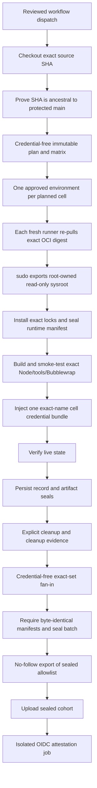

# Trusted execution design

Status: accepted for the rewritten trusted-workflow slice (PR #188)

## Summary

AXArena has two explicit runtime backends and two explicit trust levels:

- `native`: use CLIs installed on the machine that launches the cell.
- `pinned-oci`: use the reviewed OCI/sysroot and exact locked tools.
- `local`: the caller controls the machine and accepts its trust boundary.
- `hosted-trusted`: the run is produced by the reviewed hosted workflow and may
  become publication evidence after every downstream gate passes.

There is no automatic fallback between runtime backends. A request for
`pinned-oci` fails if its image, sysroot, dependency closure, executable hashes,
or sandbox cannot be verified.

Only `pinned-oci + hosted-trusted` is publishable. Reproducibility alone does
not confer publication trust.

## Before and after

### Before

The previous trusted-workflow draft had one implicit execution mode. It pinned
some top-level action and tool versions, but still depended on mutable runner
state:

- the runner image and Node selector were mutable;
- harness packages had dispatcher-selected versions and floating transitive
  dependencies;
- Bubblewrap exposed broad host runtime paths;
- a source SHA only had to equal the checked-out commit, not protected branch
  history;
- the credentialed job also owned artifact-signing authority;
- batch output had hashes, but no externally signed detached subject bound the
  source, runtime, configuration, and completed batch together.

That design could make a cumulative stack pass without giving an individual PR
a defensible trusted-execution boundary.

### After

The rewritten design makes each trust decision explicit and recorded:

1. The source is a full SHA-1 commit ID ancestral to protected `main` (the
   repository default branch). Runtime code and locks must match the protected
   branch tip even when an older benchmark artifact commit is selected.
2. The runtime lock names an exact `linux/amd64` OCI manifest digest, exact Node
   version, exact npm lock, exact harness versions, and exact downloaded archive
   and executable hashes.
3. Before credentials exist, Docker pulls the image by digest, revalidating its
   content-addressed cache, and `sudo` exports it into a root-owned,
   non-group/world-writable sysroot.
4. Exact Node from that sysroot installs and builds the locked repository and
   harness closures. Exact Bubblewrap and optional Turso artifacts are verified
   by both archive and executable SHA-256.
5. The controller runs unprivileged. Every harness probe and invocation runs in
   a fresh Bubblewrap PID/filesystem namespace with only one writable cell
   workspace and its explicit child environment.
6. Verification and durable record persistence happen before explicit cleanup.
7. The controller exports only subject-bound sealed files to a no-follow
   staging tree outside every harness-writable workspace.
8. A credential-free job reverifies a detached subject and obtains an
   OIDC/Sigstore-backed GitHub artifact attestation. The credentialed job has no
   OIDC signing permission.

## Trust matrix

| Runtime backend | Trust level | Meaning | Publishable |
| --- | --- | --- | --- |
| `native` | `local` | Local native execution with explicitly installed CLIs. Useful for development and debugging. | No |
| `pinned-oci` | `local` | Local execution using the reviewed OCI/sysroot and locks. Reproducible, but the local operator remains the trust root. | No |
| `pinned-oci` | `hosted-trusted` | Official workflow, protected source ancestry, approved environment, isolated credentials, sealed output, and detached OIDC attestation. | Yes, after aggregation/publication gates |
| `native` | `hosted-trusted` | Invalid: a hosted run cannot claim trust while using ambient native tools. | Never |

Legacy batch configurations without an `execution` declaration remain readable
as `native + local` during migration. Actual controller execution requires an
explicit runtime backend and trust level; compatibility parsing must never turn
a pinned request into native execution.

## Runtime identity

`ax-arena/benchmark/trusted-runtime/runtime-lock.json` is the reviewed runtime
root. It binds:

- the OCI image name, exact platform manifest digest, and Node version;
- `@openai/codex` and `@anthropic-ai/claude-code` through a dedicated npm v3
  lockfile, including platform packages and registry integrity values;
- Bubblewrap's versioned Debian archive, archive hash, installed path, and
  executable hash;
- Turso CLI's versioned release archive, archive hash, version output, installed
  path, and executable hash.

The workflow contains the same image reference. Dispatch validation fails when
the workflow and runtime lock differ.

The exported OCI filesystem lives at:

```text
/opt/ax-arena-runtime/rootfs
```

Reviewed tools live at:

```text
/opt/ax-arena-tools
```

Both are root-owned and non-writable by the controller. The cell sandbox maps
the OCI sysroot's `/usr` to read-only `/usr`, maps the reviewed tool tree
read-only at its canonical path, supplies a private `/proc` and `/tmp`, and
binds only the current cell workspace read-write.

## Backend selection and failure behavior

Backend and trust-level selection are data, not environment inference.

```text
execution.runtime_backend = native | pinned-oci
execution.trust_level     = local | hosted-trusted
```

The controller applies these rules:

- `native + local`: call the public `ax-eval` cell boundary with installed
  harness commands and no sandbox provenance claim.
- `pinned-oci + local`: require the exact sandbox configuration and prepared
  runtime; emit sandbox provenance; reject publication.
- `pinned-oci + hosted-trusted`: require the same runtime plus hosted workflow
  preconditions and signed detached subject.
- `native + hosted-trusted`: reject before creating a cell workspace.
- any missing pinned component: reject; never search `PATH` for a substitute.

## Hosted flow



Credentials are introduced only in the execution step. Runtime preparation,
dependency installation, build, version probes, and sandbox smoke tests happen
first. The credentialed job has `contents: read` only.

The attestation job has `id-token`, `attestations`, and `artifact-metadata`
write permissions. It uses the signer-approval `trusted-sandbox` environment,
but never references a per-cell environment or product credential; those live
only in the dynamically selected cell environments.

## Local flows

### Native local

The local caller explicitly selects `native + local`. The controller uses the
installed Codex or Claude Code CLI and records no pinned sandbox provenance.
This mode is convenient but depends on the local machine and is not accepted by
publication loaders.

### Pinned local

The local caller explicitly selects `pinned-oci + local`, prepares the same
digest-pinned sysroot and tool closure, then executes through the same
Bubblewrap adapter. It is useful for reproducing hosted behavior. It remains
non-publishable because there is no independently controlled hosted environment
or OIDC workflow identity.

## Source trust

Trusted dispatch accepts a full 40-character commit SHA only when:

- it equals checked-out `HEAD`;
- it is a commit object;
- `git merge-base --is-ancestor <sha> origin/main` succeeds (using the actual
  protected default branch name supplied by GitHub);
- runtime source, package metadata, workflow scripts, schemas, and locks are
  byte-identical to the protected branch tip;
- the selected configuration, suite, pack, and approval bytes are committed at
  the selected SHA.

Branch protection itself is a repository administration prerequisite. Required
reviewers on the `trusted-sandbox` environment remain a separate control.

## OCI caching and revalidation

Docker's content-addressed layer store is the cache. The workflow always runs
`docker pull` with the full manifest digest before extraction. Therefore:

- GitHub-hosted runners normally start cold;
- approved self-hosted runners may reuse layers keyed by digest;
- cached OCI content is reverified by Docker on every run;
- an extracted sysroot is never reused without a new verified export;
- a mutable tag is never accepted as runtime identity.

## GitHub-hosted and approved self-hosted runners

GitHub-hosted `ubuntu-22.04` is the default initial deployment.

An optional `approved-self-hosted` dispatch choice targets only the
`ax-arena-trusted` runner group with the reviewed `self-hosted`, `linux`, and
`x64` labels. The trusted environment still requires approval. The preparation
script rejects a self-hosted run unless the workflow marks that approved pool
explicitly.

Self-hosted operators must additionally guarantee ephemeral workspaces, Docker
daemon integrity, timely host-kernel patching, no colocated untrusted jobs, and
cleanup of dedicated `/opt/ax-arena-*` paths. These operational requirements do
not weaken the source, digest, lock, sandbox, or attestation checks.

## Detached attestation subject

`trusted-run-subject.json` is separate from the files it describes. It binds:

- repository and protected source SHA;
- protected default branch;
- workflow ref, workflow SHA, run ID, attempt, and environment;
- runtime-lock hash, OCI digest, runtime-manifest hash, and tool-tree hash;
- exact configuration bytes and configuration hash;
- batch ID, batch manifest hash, batch completion hash, and cell count.
- a canonical, sorted hash list of every file under `ax-arena/benchmark/daeb`.

The signing job recalculates every referenced hash before requesting the GitHub
artifact attestation. Every per-cell environment and the signing environment
must independently provide the protected variable
`AX_ARENA_APPROVED_SIGNER_SHA`; each job checks that its value is a full SHA and
equals `github.workflow_sha` before any cell credential is read or any signing
identity is requested. Downstream verification requires that same independently
approved SHA and never takes the trust anchor from the signed subject itself.
Publication also reconstructs canonical reports and metadata and inventories
every physical file. A locally copied JSON file or self-hashed manifest is not
sufficient.

## Threat model

| Threat | Control |
| --- | --- |
| Dispatcher selects unreviewed code | Full SHA plus protected-main ancestry and trust-anchor equality |
| Mutable image tag changes runtime | Exact OCI platform manifest digest |
| Dependency or optional binary drifts | Dedicated npm lock with integrity plus exact platform package checks |
| Download redirects to attacker content | HTTPS redirect policy plus mandatory archive and executable hashes |
| Harness reads verifier/reset secrets from parent `/proc` | New PID namespace and explicit child environment |
| Harness mutates source or later cells | Only the per-cell workspace is writable; source and runtime roots are outside it |
| Harness writes a secret file or symlink for artifact upload | The controller no-follow copies exactly seven hash-bound files into fixed transfer names; fan-in rejects any extra/missing transfer entry, and the writable workspace tree is never uploaded |
| Harness swaps its executable | Root-owned, non-writable command path and executable SHA verification |
| Invalid or empty trace is treated as evidence | Strict, non-empty, bounded trace validation |
| Cleanup erases evidence before scoring | Verification and record persistence precede explicit cleanup |
| Credentialed code mints an attestation | OIDC permission exists only in a separate credential-free job |
| Local output is presented as official | Trust matrix and downstream publishability gate require pinned-oci + hosted-trusted |
| Pinned runtime silently degrades | Missing/mismatched pinned components fail closed; no native fallback |
| Self-hosted cache is stale | Pull by digest and fresh verified export on every run |

Out of scope: malicious repository administrators, compromised GitHub control
plane, compromised Docker daemon or host kernel, and product credentials with
authority beyond the declared sandbox. Those remain organizational controls.

## Tradeoffs

- Exporting an OCI sysroot adds startup time and disk use, especially on fresh
  GitHub-hosted runners.
- Bubblewrap depends on host user-namespace support; the design does not disable
  seccomp or make the job privileged to work around a hostile runner.
- Exact locks require an intentional review to upgrade Node, harnesses,
  Bubblewrap, Turso, or the OCI image.
- `ubuntu-22.04` still supplies the host kernel and Docker daemon. The OCI
  digest freezes userspace, not the kernel.
- Pinned local execution improves reproduction but cannot independently prove
  who controlled the machine.

## Rollout

1. Land this design, execution-mode schemas, runtime lock, sandbox provenance,
   protected-source validator, verified sysroot preparation, and split signing
   workflow in rewritten PR #188.
2. Independently security-audit #188 and keep later PRs blocked until it is
   green.
3. Restack tool/script quarantine and fan-out PRs without weakening these
   contracts.
4. Make aggregation and publication loaders require hosted-trusted execution
   and the detached attestation binding.
5. Exercise keyless/offline contract tests in every PR. Run one separately
   approved live sandbox smoke only after the full stack is merged and the
   environment is configured.
6. Enable the approved self-hosted pool only after its operational checklist is
   reviewed; GitHub-hosted remains the default.

## Acceptance tests

Every independently mergeable PR runs Node 22:

```text
npm test
npm run typecheck
npm run build
npm run pack:check
npm --cache .npm-cache pack --dry-run
git diff --check
```

Focused #188 coverage must prove:

- `native + hosted-trusted` is rejected;
- both pinned modes require the OCI sandbox and never fall back to native;
- both pinned modes bind the verified runtime-manifest hash in every cell result
  and batch completion;
- only `pinned-oci + hosted-trusted` is publishable;
- the dispatch validator accepts protected ancestors and rejects divergent or
  trust-anchor-drifted commits, including removed historical npm, TypeScript,
  and tsup build configuration;
- workflow and runtime-lock image digests match;
- runtime/harness locks use exact versions and integrity values;
- Docker extraction and every tool probe occur before any secret expression;
- every cell environment independently approves the exact workflow SHA before
  its single credential bundle is read;
- the workflow contains no `seccomp=unconfined`, privileged container, mutable
  image tag, unpinned action, global npm install, or apt install;
- every harness detection and invocation uses the same sandbox;
- the sandbox exposes only reviewed read-only runtime roots plus one writable
  cell workspace, private `/proc`, and private `/tmp`;
- required traces are non-empty, bounded, ordered, and structurally valid;
- batch completion binds sandbox provenance and sealed artifacts;
- the credentialed job lacks OIDC/attestation permission;
- the signing job has no benchmark environment or secret expressions;
- detached-subject verification detects changes to the runtime manifest,
  configuration, batch manifest, or batch completion;
- export excludes arbitrary workspace files and symlinks and copies only the
  exact fixed-name transfer tree and sealed completion allowlist;
- the default runner is GitHub-hosted and the self-hosted option requires the
  approved label and explicit approval marker.

No acceptance test requires a live credential or network call.
